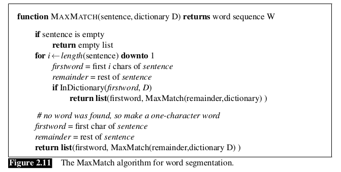
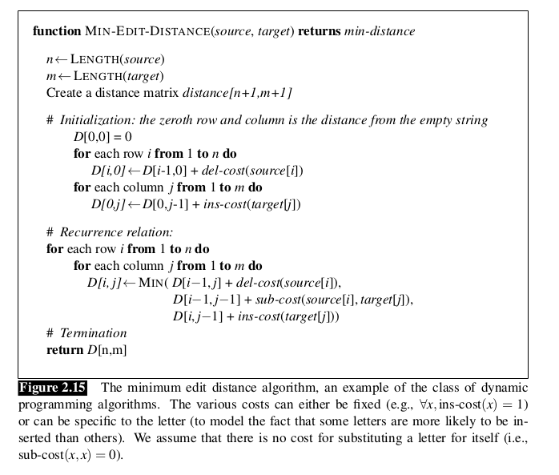

# Ch2 Regular Expressions, Text Normalization, Edit Distance
## 2.2 Words and Corpora

#### lemma & wordform
> A lemma is a set of lexical forms having the same stem, the same major part-of-speech, and the same word sense.

#### lemmatization 词形还原
sang,sung,sings 都是sing的各种形态。
**中文不存在这种情况**

#### word type & word token
> <u>Types</u> are the number of distinct words in a corpus; if the set of words in the vocabulary is V , the number of types is the vocabulary size |V|. 

> <u>Tokens</u> are the total number N of running words. 

#### Herdan's Law
ref: Herdan’s Law (Herdan, 1960) or Heaps’ Law (Heaps, 1978)

描述英文文本中，types $|V|$ 和tokens $N$ 数量的关系
$|V|=kN^\beta$
where $k$ and $\beta$ are positive constants, and $0<\beta<1$.

## 2.3 Text Normalization
#### tokenization
#### the MaxMath algorithm *
> 对汉语等没有天然分词的语言，A simple algorithm that does remarkably well for segmenting Chinese, and often used as a <mark>baseline</mark> comparison for more advanced methods, is a version of greedy search called maximum matching or sometimes MaxMatch. The algorithm <mark>requires a dictionary</mark> (wordlist) of the language.

The maximum matching algorithm starts by pointing at the beginning of a string. It chooses the longest word in the dictionary that matches the input at the current position. The pointer is then advanced to the end of that word in the string. If no word matches, the pointer is instead advanced one character (creating a one- character word).

Pros:
- Simple
- Works on Chinese

Cons:
- Doesn’t work as well on English.
- Terrible when encountering unknown words (words not in the dictionary) or genres that differ a lot from the assumptions made by the dictionary builder.

#### Sentence Segmentation
The most useful cues for segmenting a text into sentences are punctuation, like periods, question marks, exclamation points. Question marks and exclamation points are relatively unambiguous markers of sentence boundaries. Periods, on the other hand, are more ambiguous. The period character “.” is ambiguous between a sentence boundary marker and a marker of abbreviations like Mr. or Inc. The previous sentence that you just read showed an even more complex case of this ambiguity, in which the final period of Inc. marked both an abbreviation and the sentence boundary marker. For this reason, <mark>sentence tokenization and word tokenization may be addressed jointly.</mark>

## 2.4 Minimum Edit Distance
> the minimum edit distance between two strings is defined as the minimum number of editing operations (operations like <u>insertion</u>, <u>deletion</u>, <u>substitution</u>) needed to transform one string into another.

#### Levenshtein distance
可以为<u>insertion</u>, <u>deletion</u>, <u>substitution</u>等三种操作指定权重.
默认情况下，三种操作的权重都是1.

### The Minimum Edit Distance Algorithm

Knowing the minimum edit distance is useful for algorithms like finding potential spelling error corrections. But the edit distance algorithm is important in another way; with a small change, it can also provide the minimum cost alignment between two strings. Aligning two strings is useful throughout speech and language process- ing. In speech recognition, minimum edit distance alignment is used to compute the word error rate (Chapter 31). Alignment plays a role in machine translation, in which sentences in a parallel corpus (a corpus with a text in two languages) need to be matched to each other.

